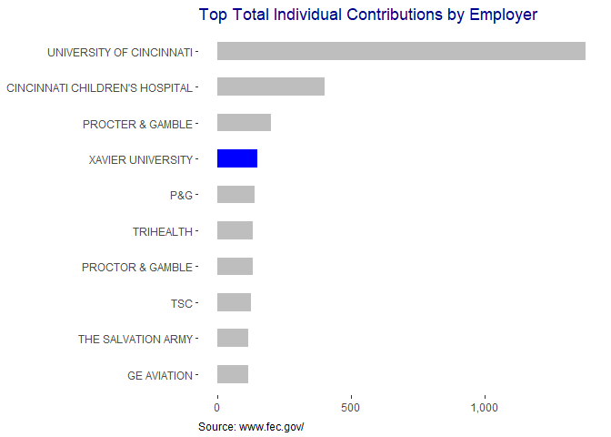
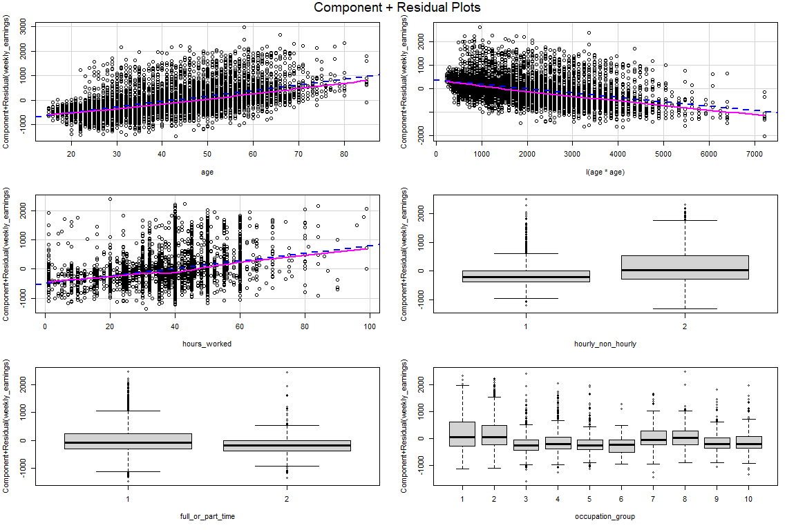
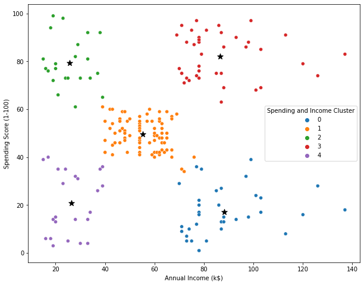
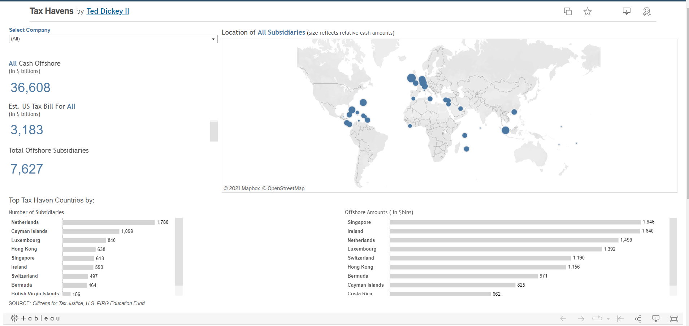

# Ted Dickey Project Portfolio
Example Data Science, Analytics, and Business Intelligence Portfolio

# [Project 1: Data Cleaning in SQL (ETL): Overview](https://github.com/analyticsbyted/PortfolioProjects)
* Extracted data from csv file from server.
* Standardized date format.
* Populatated some missing PropertyAddress fields.
* Split Address field into Address, City and State features.
* Changed 'Y' and 'N' to 'Yes' and 'No' in 'Sold as Vacant' field.
* Removed clearly duplicated records.
* Removed unused columns.

# [Project 1: Political Contributions: Project Overview](https://rpubs.com/dickeyt/contributions)
### Exploratory data analysis (R programming language)
* Created a tool that identifies Cincinnati-area contributers and amounts to political campaigns
* Scrapped data from FEC website from period 2015-2019.
* Simple analytics performed and trends on contribution variance amounts for the two most recent cycles.
* Directed analysis top contributors to politics from the city and the recepients.
* Built GGPlots to visualize findings

# [Project 2: Telecommuting](https://rpubs.com/dickeyt/telecommute)
### Multiple linear regression (R programming language)
For this example project I built a linear regression model to estimate weekly earnings by telecommute status, age,  and by hours worked. This could be useful for someone who is looking to maximize or minimize wages paid.

I was able to get the model to predict average weekly earnings at a 95% confidence level after minimal tuning and transformations.

# [Project 3: Shopping Customer Segmentation: Project Overview](https://github.com/analyticsbyted/customer_segmentation/blob/main/Project2.ipynb)
### Unsupervised Machine Learning Example (Python)
**Problem Statement:** Understand the target customers for the marketing team to plan a strategy.

**Context:** Client wants the most important shopping groups identified based on income, age, and the mall shopping score.

Client wants the ideal number of groups with a label for each.

* Created subsets of a market based on demographic behavioral criteria to better understand the target for marketing activities.
* Data provided needed minimal cleaning and tranformation of Gender predictor from character to factor.
* Performed quick EDA
* Used KMEANS clustering algorithm to create segments
* Used summary statistics on the clusters.
* Created visualization

# [Project 4: Corporate Tax Havens Dashboard: Overview](https://public.tableau.com/app/profile/tdickey/viz/TaxHavens_15973738382660/OffshoreCash)
### Tableau data visualization
* Constructed Dashboard that shows all cash offshore, estimated US tax bill and totalk offshore subsidiares as KPIs.
* Global map depiction of locations
* Tables for top tax havens by country and amounts

# [Return to Analytics By Ted Portolio](https://analyticsbyted.github.io/portfolio/index.html)
